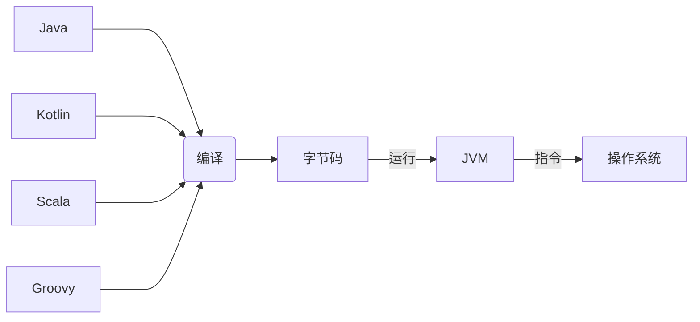

## 目录

*   [基础](#基础)

    *   [变量](#变量)

    *   [条件语句](#条件语句)

    *   [String 模版](#string-模版)

*   [NULL与异常](#null与异常)

    *   [NULL检查机制](#null检查机制)

    *   [ 使用带let的安全调用](#-使用带let的安全调用)

*   [函数](#函数)

    *   *   [函数参数](#函数参数)

        *   [Unit函数](#unit函数)

        *   [Nothing类型](#nothing类型)

    *   [反引号中的函数名](#反引号中的函数名)

    *   [匿名函数](#匿名函数)

        *   [函数类型与隐式返回](#函数类型与隐式返回)

        *   [函数参数](#函数参数-1)

        *   [it 关键字](#it-关键字)

        *   [类型推断](#类型推断)

        *   [定义参数是函数的函数](#定义参数是函数的函数)

    *   [Lambda](#lambda)

        *   [简\*调用函数作为参数的函数](#简调用函数作为参数的函数)

        *   [函数内联](#函数内联)

    *   [函数引用](#函数引用)

    *   [闭包](#闭包)

    *   [lambda与匿名函数类](#lambda与匿名函数类)

    *   [函数类型作为返回类型](#函数类型作为返回类型)

*   [类和对象](#类和对象)

    *   [类的属性](#类的属性)

    *   [getter和setter](#getter和setter)

        *   [实例](#实例)

    *   [主构造器](#主构造器)

        *   [实例](#实例-1)

    *   [次构造函数](#次构造函数)

        *   [实例](#实例-2)

    *   [抽象类](#抽象类)

    *   [嵌套类](#嵌套类)

    *   [内部类](#内部类)

    *   [匿名内部类](#匿名内部类)

    *   [类的修饰符](#类的修饰符)

# Kotlin

[Android](https://www.wolai.com/3JzxXVPXc1caQdksjXrQht "Android")

[by](https://www.wolai.com/4x4usUKDQBd14gTJ41SvzW "by")

# 基础



## 变量

*   `变量定义关键字`  `变量名` \[`：` `类型定义` ]`赋值运算符` `赋值`

    *   `var`可变变量； `val` 只读变量；

        `const var`编译时常亮只能在函数之外定义(`final static`)，因为编译时常量必须在编译时赋值，而函数都是在运行时调用，函数内的变量也是在运行时赋值，编译时常量要在这些变量赋值前就存在。

    *   Kotlin 支持类型推断

    *   Kotlin只有引用类型

        

        *   Java有引用类型和基本数据类型

        *   Kotlin出于更高性能的需要，Kotlin编译器会在字节码中改用基本数据类型

## 条件语句

**range表达式**：`in`关键字检查某个值是否在指定范围之内

```kotlin
var age =4
if(age in 0..3){
   println("kids")
}else if(age !in 3..12){
   println("not childen")
} else{
   println("unkonw")
}
```

**when表达式**：类似switch-cases

```kotlin
val school = "小学"
val level = when(school){
    "perschool" -> "infant"
     "primary school"->"kids"
     "high school"->"teen"   
}else->{
    println("else")
}
```

## String 模版

*   模版支持在字符串的引号内放入**变量值**

*   还支持字符串里**计算表达式的值并插入结果**，在添加`${}`中的任何表达式，都会作为字符串的一部分求值

```kotlin
val origin = "YY_in"
val dest = "Kotlin"

println("$origin love $dest")

val flag = false
println("Answer is" $(if(flag)) "我可以" else "对不起")


```

# NULL与异常

## NULL检查机制

Kotlin的空安全设计对于声明可为空的参数，在使用时要进行空判断处理，有两种处理方式，字段后加!!像Java一样抛出空异常，另一种字段后加?可不做处理返回值为 **null** 或配合 ?: 做空判断处理

```java
//类型后面加?表示可为空
var age: String? = "23" 
//抛出空指针异常
val ages = age!!.toInt()
//不做处理返回 null
val ages1 = age?.toInt()
//age为空返回-1
val ages2 = age?.toInt() ?: -1
```

当一个引用可能为 null 值时, 对应的类型声明必须明确地标记为可为 null。

当 str 中的字符串内容不是一个整数时, 返回 null:&#x20;

```java
fun parseInt(str: String): Int? {
    return str.toIntOrNull()
}

fun printProduct(arg1: String, arg2: String) {
    val x = parseInt(arg1)
    val y = parseInt(arg2)

    // 直接使用 `x * y` 会导致错误, 因为它们可能为 null
    if (x != null && y != null) {
        // 在进行过 null 值检查之后, x 和 y 的类型会被自动转换为非 null 变量
        println(x * y)
    }
    else {
        println("'$arg1' or '$arg2' is not a number")
    }    
}

fun main() {
    printProduct("6", "7")
    printProduct("a", "7")
    printProduct("a", "b")
}
```

## &#x20;使用带let的安全调用

安全调用允许在可空类型上调用，但是如果还想做点额外的事，比如创建新值，或者判断不为null就调用其他函数，怎么办？

使用`let`函数的安全调用操作符，你可以在任何类型上调用let函数，它主要作用是让你在指定的作用域内定义一个或多个变量。

```kotlin
fun main{
    val str = readLine()?.let{
        //如果非空
        if(it.isNotBlank()){
            //大写
            it.capitalize()
        }else{
            "butterfly"
        }
    }
    println(str)
}
```

`let`函数的表达式返回的是lambda的最后一行

# 函数

【`可见性修饰符` 】`函数声明关键字` `函数名`  (`函数参数`) : `返回值类型`

### 函数参数

*   默认参数

    *   如果不打算传入值参，可以预先给参数指定默认值

*   具名函数参数

    *   如果使用命名值参，就可以不用管值参的顺序，指定参数名赋值

### Unit函数

不是所有函数都有返回值，Kotlin中没有返回值的函数叫Unit函数,也就是说他们的返回类型是Unit。在Kotlin之前，函数不返回任何东西用void描述，但是void这种方法无法解释现代语言的重要特性——泛型。

### Nothing类型

*   TODO函数的任务就是抛出异常，就永远别指望它运行成功，返回Nothing类型

```kotlin
fun main(){
    println(fix(age=10,name="Rose"))
    TODO("nothing")
    println("after nothing")
}
fun fix(name:String,age:Int =2){
    println(name+age)
}
```

直接抛出异常，不打印 after nothing,可用于终止程序运行

## 反引号中的函数名

应用测试的描述

*   Kotlin可以使用空格和特殊字符对函数命名，不过函数要用一对反引号括起来

    ```kotlin
    fun `**~special function with weird name~**`(){}

    ```

*   为了支持Kotlin和Java互操作，而Kotlin和Java各自却保留着不同关键字，不能作为函数名，使用反引号括住函数名就能避免任何冲突

    ```java
    public class MyJava{
        public static void is(
            System.out.println("from java is invoked");
        )
    }
    ```

    ```kotlin
    Myjava.`is`()
    ```

## 匿名函数

### 函数类型与隐式返回

*   匿名函数也有类型，匿名函数可以当作变量赋值给函数类型变量，就像其他变量一样，匿名函数就可以在代码中传递了。变量有类型，变量可以等于函数，函数也会有类型。函数的类型，由传入的参数和返回值类型决定。

    ```kotlin
    val blessingFunction:() -> String
    blessingFunction = {
        var holiday = "New Year."
        return "Happy $holiday"
    }
    ```

*   和具名函数不一样，除了极少数情况外，匿名函数不需要return关键字来返回数据，匿名函数会隐式或自动返回函数体最后一行语句的结果。

### 函数参数

和匿名函数一样，匿名函数可以不带参数，也可以带一个或多个任何类型的参数，需要带参数时，参数的类型放在匿名函数的类型定义中，参数名放在函数定义里

```kotlin
val blessingFunction:(String) -> String = {name ->
    var holiday = "New Year."
    "$name ,Happy $holiday"
} 

println(blessingFunction("YY-in"))
```

### it 关键字

*   定义只有一个参数的匿名函数时，可以使用it关键字来表示参数名。当你需要传入2个值参，it关键字就不能用了

    ```kotlin
    val blessingFunction:(String) -> String = {it ->
        var holiday = "New Year."
        "$it ,Happy $holiday"
    } 

    println(blessingFunction("YY-in"))
    ```

### 类型推断

```kotlin
//很像Java的静态代码块，但是实际上是匿名函数
val blessingFunction = {
    var holiday = "New Year."
    return "Happy $holiday"
}
```

类型推断也支持带参数的匿名函数，但为了帮助编译器更准确地判断变量类型，匿名函数的参数名和参数类型必须有。

```kotlin
val blessingFunction = {name:String,year:Int ->
    var holiday = "New Year."
    "$name ,Happy $holiday"
} 

println(blessingFunction("YY-in",2022))
```

### 定义参数是函数的函数


## Lambda

我们将匿名函数称之为lambda，将它的定义称之为lambda表达式，它返回的数据称之为lambda结果。在定义匿名函数时，使用lambda演算记法。

### 简\*调用函数作为参数的函数

如果一个函数的lambda参数排在最后，或者是唯一的参数，那么括住lambda值参的一对圆括号就可以省略。

原先main函数当中对`showOnBoard()`的调用

就直接省略作为参数的函数的申明

```kotlin
showOnBoard("卫生纸"){goodName: String,hour:Int -> 
    val currentYear = 2027
    "${currentYear}年，${goodName}促销倒计时: $hour 小时"
}
```

### 函数内联

*   自由灵活的编写代码，是以增加内存开销作为代价的。

    在JVM中，定义的lambda会以对象实例的恶形式存在，JVM会为所有通lambda打交道的变量分配内存，这样就产生了开销。

    幸运的是，kotlin提供了**内联机制**，避免变量内存的分配。哪里需要使用lambda，编译器就会将函数体复制粘贴到哪里。

*   使用lambda的递归函数无法内联，因为无限的复制粘贴，编译器会警告

内联函数定义的时候在`fun`前使用`inline`关键字

## 函数引用

要把函数作为参数传递给其他函数使用，除了传统传lambda表达式，kotlin还提供了其他方法，传递函数引用，函数引用可以把一个具名函数转换成一个值参，使用lambda表达式的地方，都可以使用函数引用`::`。

```kotlin
fun main(){
    showOnBoard("牙膏"，::getDiscountWords)
}
fun getDiscountWords(goodName:String,hour:Int):String{
    val currentYear=2022
    return "${currentYear}年，${goodName}促销倒计时: $hour 小时"
}
fun showOnBoard(goodname:String,getDiscountWords:(String,Int)->String){
    val hour=(1..24).shuffled().last()
    println(getDiscountWords(goodName,hour))
}
```

## 闭包

*   在Kotlin中，匿名函数能修改并引用定义在自己作用域之外的变量，匿名函数引用着定义自身的函数里的变量，Kotlin中lambda就是闭包

*   能够接收函数或者返回函数的函数叫做高级函数，高级函数广泛应用于函数式编程当中

## lambda与匿名函数类

函数类型能够让开发者少写模式化代码，写出更加灵活的代码。Java 8支持面向对象编程和lambda表达式，但不支持将函数作为参数传给另一个函数或参数，不过Java的替代方案就是匿名内部类

## 函数类型作为返回类型

函数类型也是有效的返回类型，也就是说可以定义一个能返回函数的恶函数

```kotlin
fun maia(){
    val getDiscountWords = configDiscountWord();
    println(getDiscountWords("牙膏"))
}
fun configDiscountWords():(String)-> String{
    val currentYear =2022
    val hour=(1..24).shuffled().last()  
    retrun {goofName:String ->
         hour += 20
        "${currentYear}年，${goodName}促销倒计时: $hour 小时"
    }
}
```

Kotlin的空安全设计对于声明可为空的参数，在使用时要进行空判断处理，有两种处理方式，字段后加!!像Java一样抛出空异常，另一种字段后加?可不做处理返回值为 null 或配合 ?: 做空判断处理

Kotlin的空安全设计对于声明可为空的参数，在使用时要进行空判断处理，有两种处理方式，字段后加!!像Java一样抛出空异常，另一种字段后加?可不做处理返回值为 null 或配合 ?: 做空判断处理

# 类和对象

## 类的属性

*   我们可以像使用普通函数那样使用构造函数创建类实例：

    ```kotlin
      val site = Runoob() // Kotlin 中没有 new 关键字
    ```

*   Kotlin 中的类可以有一个 主构造器，以及一个或多个次构造器，主构造器是类头部的一部分，位于类名称之后:&#x20;

    ```kotlin
    class Person constructor(firstName: String) {}
    ```

*   如果主构造器没有任何注解，也没有任何可见度修饰符，那么constructor关键字可以省略。

    ```kotlin
    class Person(firstName: String) {
    }
    ```

## getter和setter

属性声明的完整语法：

```java
var <propertyName>[: <PropertyType>] [= <property_initializer>]
    [<getter>]
    [<setter>]
```

etter 和 setter 都是可选

如果属性类型可以从初始化语句或者类的成员函数中推断出来，那就可以省去类型，val不允许设置setter函数，因为它是只读的。

```kotlin
var allByDefault: Int? // 错误: 需要一个初始化语句, 默认实现了 getter 和 setter 方法
var initialized = 1    // 类型为 Int, 默认实现了 getter 和 setter
val simple: Int?       // 类型为 Int ，默认实现 getter ，但必须在构造函数中初始化
val inferredType = 1   // 类型为 Int 类型,默认实现 getter
```

### 实例

以下实例定义了一个 Person 类，包含两个可变变量 lastName 和 no，lastName 修改了 getter 方法，no 修改了 setter 方法。

```kotlin
class Person {

    var lastName: String = "zhang"
        get() = field.toUpperCase()   // 将变量赋值后转换为大写
        set

    var no: Int = 100
        get() = field                // 后端变量
        set(value) {
            if (value < 10) {       // 如果传入的值小于 10 返回该值
                field = value
            } else {
                field = -1         // 如果传入的值大于等于 10 返回 -1
            }
        }

    var heiht: Float = 145.4f
        private set
}

// 测试
fun main(args: Array<String>) {
    var person: Person = Person()

    person.lastName = "wang"

    println("lastName:${person.lastName}")

    person.no = 9
    println("no:${person.no}")

    person.no = 20
    println("no:${person.no}")

}
```

Kotlin 中类不能有字段。提供了 Backing Fields(后端变量) 机制,备用字段使用field关键字声明,field 关键词只能用于属性的访问器，如以上实例

非空属性必须在定义的时候初始化,kotlin提供了一种可以延迟初始化的方案,使用 lateinit 关键字描述属性：

```kotlin
public class MyTest {
    lateinit var subject: TestSubject

    @SetUp fun setup() {
        subject = TestSubject()
    }

    @Test fun test() {
        subject.method()  // dereference directly
    }
}
```

## 主构造器

```kotlin
class Person constructor(firstName: String) {
    init {
        println("FirstName is $firstName")
    }
}
```

注意：主构造器的参数可以在初始化代码段中使用，也可以在类主体n定义的属性初始化代码中使用。 一种简洁语法，可以通过主构造器来定义属性并初始化属性值（可以是var或val）

```kotlin
class People(val firstName: String, val lastName: String) {
    //...
}
```

如果构造器有注解，或者有可见度修饰符，这时constructor关键字是必须的，注解和修饰符要放在它之前。

### 实例

创建一个 Runoob类，并通过构造函数传入网站名：

```kotlin
class Runoob  constructor(name: String) {  // 类名为 Runoob
    // 大括号内是类体构成
    var url: String = "https://blog.yyin.top"
    var country: String = "CN"
    var siteName = name

    init {
        println("初始化网站名: ${name}")
    }

    fun printTest() {
        println("我是类的函数")
    }
}

fun main(args: Array<String>) {
    val runoob =  Runoob("菜鸟教程")
    println(runoob.siteName)
    println(runoob.url)
    println(runoob.country)
    runoob.printTest()
}
```

## 次构造函数

类也可以有二级构造函数，需要加前缀 constructor:

```kotlin
class Person { 
    constructor(parent: Person) {
        parent.children.add(this) 
    }
}
```

如果类有主构造函数，每个次构造函数都要，或直接或间接通过另一个次构造函数代理主构造函数。在同一个类中代理另一个构造函数使用 this 关键字：

```kotlin
class Person(val name: String) {
    constructor (name: String, age:Int) : this(name) {
        // 初始化...
    }
}
```

如果一个非抽象类没有声明构造函数(主构造函数或次构造函数)，它会**产生一个没有参数的构造函数**。构造函数是 public 。如果你不想你的类有公共的构造函数，你就得声明一个空的主构造函数：

```kotlin
class DontCreateMe private constructor () {
}
```

### 实例

```kotlin
class Runoob  constructor(name: String) {  // 类名为 Runoob
    // 大括号内是类体构成
    var url: String = "http://www.runoob.com"
    var country: String = "CN"
    var siteName = name

    init {
        println("初始化网站名: ${name}")
    }
    // 次构造函数
    constructor (name: String, alexa: Int) : this(name) {
        println("Alexa 排名 $alexa")
    }

    fun printTest() {
        println("我是类的函数")
    }
}

fun main(args: Array<String>) {
    val runoob =  Runoob("菜鸟教程", 10000)
    println(runoob.siteName)
    println(runoob.url)
    println(runoob.country)
    runoob.printTest()
}
```

## 抽象类

抽象是面向对象编程的特征之一，类本身，或类中的部分成员，都可以声明为abstract的。抽象成员在类中不存在具体的实现。

注意：无需对抽象类或抽象成员标注open注解。

```kotlin
open class Base {
    open fun f() {}
}

abstract class Derived : Base() {
    override abstract fun f()
}
```

## 嵌套类

我们可以把嵌套在其他类中，看一下实例：

```kotlin
class Outer {                  // 外部类
    private val bar: Int = 1
    class Nested {             // 嵌套类
        fun foo() = 2
    }
}

fun main(args: Array<String>) {
    val demo = Outer.Nested().foo() // 调用格式：外部类.嵌套类.嵌套类方法/属性
    println(demo)    // == 2
}
```

## 内部类

内部类使用 inner 关键字来表示。

内部类会带有一个对外部类的对象的引用，所以内部类可以访问外部类成员属性和成员函数。

```kotlin
class Outer {
    private val bar: Int = 1
    var v = "成员属性"
    /**嵌套内部类**/
    inner class Inner {
        fun foo() = bar  // 访问外部类成员
        fun innerTest() {
            var o = this@Outer //获取外部类的成员变量
            println("内部类可以引用外部类的成员，例如：" + o.v)
        }
    }
}

fun main(args: Array<String>) {
    val demo = Outer().Inner().foo()
    println(demo) //   1
    val demo2 = Outer().Inner().innerTest()   
    println(demo2)   // 内部类可以引用外部类的成员，例如：成员属性
}

```

## 匿名内部类

使用对象表达式来创建匿名内部类：

```kotlin
class Test {
    var v = "成员属性"

    fun setInterFace(test: TestInterFace) {
        test.test()
    }
}

/**
 * 定义接口
 */
interface TestInterFace {
    fun test()
}

fun main(args: Array<String>) {
    var test = Test()

    /**
     * 采用对象表达式来创建接口对象，即匿名内部类的实例。
     */
    test.setInterFace(object : TestInterFace {
        override fun test() {
            println("对象表达式创建匿名内部类的实例")
        }
    })
}
```

## 类的修饰符

类的修饰符包括 classModifier 和\_accessModifier\_:

*   classModifier: 类属性修饰符，标示类本身特性。

    ```kotlin
    abstract    // 抽象类  
    final       // 类不可继承，默认属性
    enum        // 枚举类
    open        // 类可继承，类默认是final的
    annotation  // 注解类
    ```

*   accessModifier: 访问权限修饰符

    ```kotlin
    private    // 仅在同一个文件中可见
    protected  // 同一个文件中或子类可见
    public     // 所有调用的地方都可见
    internal   // 同一个模块中可见
    ```
